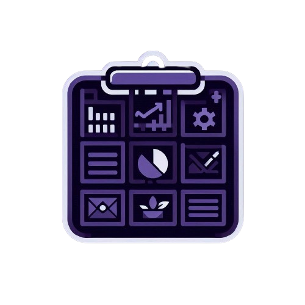

<!-- Improved compatibility of back to top link: See: https://github.com/othneildrew/Best-README-Template/pull/73 -->

<a name="readme-top"></a>

<!--
*** Thanks for checking out the Best-README-Template. If you have a suggestion
*** that would make this better, please fork the repo and create a pull request
*** or simply open an issue with the tag "enhancement".
*** Don't forget to give the project a star!
*** Thanks again! Now go create something AMAZING! :D
-->

<!-- PROJECT SHIELDS -->
<!--
*** I'm using markdown "reference style" links for readability.
*** Reference links are enclosed in brackets [ ] instead of parentheses ( ).
*** See the bottom of this document for the declaration of the reference variables
*** for contributors-url, forks-url, etc. This is an optional, concise syntax you may use.
*** https://www.markdownguide.org/basic-syntax/#reference-style-links
-->

[![Contributors][contributors-shield]][contributors-url]
[![Forks][forks-shield]][forks-url]
[![Stargazers][stars-shield]][stars-url]
[![Issues][issues-shield]][issues-url]
[![MIT License][license-shield]][license-url]
[![LinkedIn][linkedin-shield]][linkedin-url]

<!-- PROJECT LOGO -->
<br />
<div align="center">
  <a href="https://github.com/othneildrew/Best-README-Template">
    
  </a>

  <h3 align="center">Kanban Board Nextjs</h3>

  <p align="center">
    An awesome Kanban Board website for organize yours projects!
    <br />
    <a href="https://github.com/matheus55391/kanban_board"><strong>Explore the docs »</strong></a>
    <br />
    <br />
    <a href="https://github.com/matheus55391/kanban_board">View Demo</a>
    ·
    <a href="https://github.com/matheus55391/kanban_board/issues/new">Report Bug</a>
    ·
    <a href="https://github.com/matheus55391/kanban_board/issues/new">Request Feature</a>
    ·
    <a href="https://www.figma.com/design/m2rk7rIYt9HzU8on2TnOqB/Kanban-nextjs-app?node-id=0-1&t=9Hye9aLVJV4gUjAG-0">Figma</a>
    
  </p>
</div>

<!-- ABOUT THE PROJECT -->

## About The Project

[![Product Name Screen Shot][product-screenshot]](https://www.figma.com/design/m2rk7rIYt9HzU8on2TnOqB/Kanban-nextjs-app?node-id=0-1&t=9Hye9aLVJV4gUjAG-0)

Welcome to our Kanban project management tool, designed to enhance organization and efficiency, inspired by the flexibility of ClickUp.

Here’s why this project stands out:

Focus on Innovation: Our tool allows you to channel your energy into creating something amazing, helping to streamline workflows and boost productivity.
Avoid Repetition: Eliminate the tedious task of repetitive project setup. Our Kanban tool simplifies the process, so you can get started quickly.
Embrace Efficiency: Apply the DRY (Don't Repeat Yourself) principles not just in your coding practices but in your project management as well. :smile:
We understand that every project has unique needs, which is why we’re committed to continuously enhancing this tool. We welcome your suggestions and contributions—fork this repository, create a pull request, or open an issue to share your ideas.

Thank you to everyone who has contributed to making this project better!

Get started and elevate your project management with our Kanban tool.

<p align="right">(<a href="#readme-top">back to top</a>)</p>

### Built With

- [![Next][Next.js]][Next-url]
- [![React][React.js]][React-url]

<p align="right">(<a href="#readme-top">back to top</a>)</p>

<!-- GETTING STARTED -->

### Installation

_Below is an example of how you can instruct your audience on installing and setting up your app. This template doesn't rely on any external dependencies or services._

1. For runnig this project you need use this API (http://linkapi.com)
2. Clone the repo
   ```sh
   git clone https://github.com/matheus55391/kanban_board.git
   ```
3. Install NPM packages
   ```sh
   npm install
   ```
4. Enter your ENVs in `.env`
   ```js
   const API_KEY = "ENTER YOUR API";
   ```
5. Running in dev mode
   ```sh
   npm run dev
   ```

<p align="right">(<a href="#readme-top">back to top</a>)</p>

## Contact

Linkedin - [@matheus55391](https://www.linkedin.com/in/matheus-felipe-vieira-santiago-5a321a208/) - matheus.felipe55391@gmail.com

Project Link: [https://github.com/matheus55391/kanban_board](https://github.com/matheus55391/kanban_board)

<p align="right">(<a href="#readme-top">back to top</a>)</p>

<!-- MARKDOWN LINKS & IMAGES -->
<!-- https://www.markdownguide.org/basic-syntax/#reference-style-links -->

[contributors-shield]: https://img.shields.io/github/contributors/matheus55391/kanban_board.svg?style=for-the-badge
[contributors-url]: https://github.com/matheus55391/kanban_board/graphs/contributors
[forks-shield]: https://img.shields.io/github/forks/matheus55391/kanban_board.svg?style=for-the-badge
[forks-url]: https://github.com/matheus55391/kanban_board/network/members
[stars-shield]: https://img.shields.io/github/stars/matheus55391/kanban_board.svg?style=for-the-badge
[stars-url]: https://github.com/matheus55391/kanban_board/stargazers
[issues-shield]: https://img.shields.io/github/issues/matheus55391/kanban_board.svg?style=for-the-badge
[issues-url]: https://github.com/matheus55391/kanban_board/issues
[license-shield]: https://img.shields.io/github/license/matheus55391/kanban_board.svg?style=for-the-badge
[license-url]: https://github.com/matheus55391/kanban_board/blob/master/LICENSE.txt
[linkedin-shield]: https://img.shields.io/badge/-LinkedIn-black.svg?style=for-the-badge&logo=linkedin&colorB=555
[linkedin-url]: https://www.linkedin.com/in/matheus-felipe-vieira-santiago-5a321a208/
[product-screenshot]: public/product.png
[Next.js]: https://img.shields.io/badge/next.js-000000?style=for-the-badge&logo=nextdotjs&logoColor=white
[Next-url]: https://nextjs.org/
[React.js]: https://img.shields.io/badge/React-20232A?style=for-the-badge&logo=react&logoColor=61DAFB
[React-url]: https://reactjs.org/
